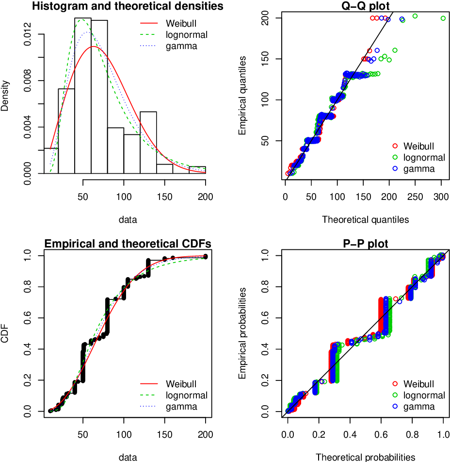

# Calibration d'une distribution

Ce projet Python vise à estimer les paramètres de diverses distributions statistiques pour une série de données donnée, en utilisant les méthodes des moments (mme) et du maximum de vraisemblance (mle). Nous évaluerons également la pertinence de ces distributions pour les données fournies.



## Table des matières

1. [Données](#donnees)
2. [Objectif](#objectif)
3. [Méthodologie](#methodologie)
4. [Exemple de visualisation](#exemple-de-visualisation)
5. [Références](#references)

<a name="donnees"></a>

## Données

Nous disposons de la série de données suivante :
```python
data = [0.528, 0.452, 1.33, 0.626, 4.504, 1.011, 3.801, 1.685, 0.944, 10.691,
        3.012, 1.943, 3.388, 0.75, 0.561, 3.592, 0.88, 6.539, 0.809, 6.954,
        0.993, 5.33, 0.744, 1.864, 2.363, 0.58, 1.772, 0.372, 4.797, 3.651,
        0.593, 0.968, 1.119, 1.791, 0.223, 5.809, 0.485, 0.328, 0.669, 1.325,
        0.675, 0.556, 0.928, 0.689, 0.486, 0.813, 0.098, 0.571, 0.4, 1.03,
        0.398, 3.072, 3.551, 0.475, 3.942, 1.84, 0.634, 0.307, 0.761, 0.661,
        0.45, 2.186, 0.844, 0.354, 31.693, 3.653, 8.986, 1.233, 0.163, 1.662,
        2.288, 1.147, 0.438, 0.488, 0.305, 0.11, 0.432, 1.022, 0.846, 0.607,
        0.102, 0.475, 0.459, 1.545, 1.992, 1.558, 1.305, 1.103, 0.568, 1.042,
        2.055, 1.412, 5.709, 1.772, 0.41, 1.137, 1.705, 0.389, 0.833, 0.275]

## Prérequis
Avant de commencer, assurez-vous d'avoir les éléments suivants installés sur votre machine:
- Python 3.x
- Bibliothèques Python: requirements.txt

## Installation
Clonez ce dépôt GitHub sur votre machine locale en utilisant la commande suivante:
```bash
git clone https://github.com/judeLuther/calibration-distribution.git